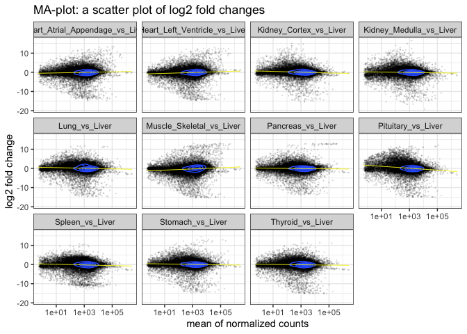
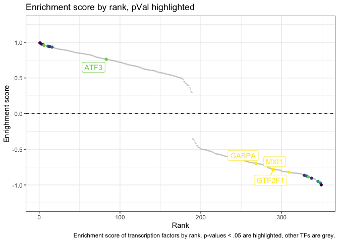

# GTEX RNA-seq Liver-specific Process and TF Identification
Patrick Cherry
2023-12-14

# Introduction

I use the publicly available bulk RNA-Seq data from
[GTEX](https://www.gtexportal.org/home/downloads/adult-gtex) (v8)
identify biological pathways and processes specific to the liver. I also
identify putative transcriptional regulators of these pathways and
processes. To ensure that the analysis fits into local memory, I
restrict the features in scope to be protein-coding genes, and the
tissues in scope to be the following following: heart, kidney, liver,
lung, muscle, pancreas, spleen, stomach, pituitary gland, and thyroid.

## Notes on approach

[The GTEx Consortium atlas of genetic regulatory effects across human
tissues](https://www.science.org/doi/full/10.1126/science.aaz1776) The
Genotype-Tissue Expression (GTEx) project was established to
characterize genetic effects on the transcriptome across human tissues
and to link these regulatory mechanisms to trait and disease
associations.

I’m interpreting “specific to the liver” to mean uniquely expressed in
the liver compared to each other tissue in scope. I will express this in
the analysis by running instructing DEseq to run a one-to-many test by
ranking liver first among the tissue factors, and then running a p-value
meta-analysis on the p-value results for features (protein-coding genes)
in all comparisons. (Meaning, it only takes one liver-to-tissue
comparison revealing that a gene is NOT up-regulated in the liver to
remove that gene from consideration.)

## Patrick’s hypothesis

Given this is liver RNA-seq, I expect to see genes implicated in the
liver main roles, namely:

- conditioning the blood by secreting important proteins into it, like
  serum albumin, immune complement proteins, C-reactive protein,
  clotting factors (pre-pro-thrombin, fibrinogen, plasminogen), etc.
- cytochrome P450 proteins (CYPxxx), by which the liver catabolizes
  xenobiotics
- glycolysis, gluconeogenesis, and fatty acid catabolism
- bile salts catabolism and anabolism (cholesterols,
  hemoglobin/porphyrin)
- amino acid conversion and catabolism

``` r
knitr::opts_chunk$set(echo = TRUE)  # set default chunk option to not print the code that generated that output
library(usethis)
library(readr)                  # for reading and writing csvs
library(fs)                     # for filesystem navigation in R
library(dplyr)                  # for dataframe manipulation
library(tidyr)                  # for dataframe group nesting and manipulation
library(purrr)                  # for functional programming, including on nested dataframes
library(readxl)                 # for reading excel files
library(stringr)                # for efficient string manipulation
library(magrittr)               # for enhanced pipes
library(broom)                  # for model manipulation
library(forcats)                # for factor manipulation
library(ggplot2)                # for additional plotting features
library(ensembldb)
library(DESeq2)
library(AnnotationDbi)
library(org.Hs.eg.db)
library(gage)
library(pathview)
library(gageData)
library(TFEA.ChIP)              # analyze transcription factor enrichment in a gene set
library(BiocParallel)           # speed up some parallelizeable processing
register(MulticoreParam(4))     # set core parallelization to 4 CPU cores
theme_set(theme_bw())           # set the default ggplot theme to be clear & cartooney
```

# Metadata (sample annotations)

Samples come from
https://github.com/broadinstitute/gtex-v8/blob/master/data/GTEx_Analysis_v8_RNAseq_samples.txt,
and have to be manually downloaded.

``` r
gtex_samples <- read.delim("../GTEx_Analysis_v8_RNAseq_samples.txt", sep = "\t") %>%
  mutate("sample_id" = str_replace_all(sample_id, "-", "\\."))
```

``` r
gtex_samples %>% dplyr::count(tissue_id) %>% arrange(desc(n))
```

                                   tissue_id   n
    1                        Muscle_Skeletal 803
    2                            Whole_Blood 755
    3             Skin_Sun_Exposed_Lower_leg 701
    4                   Adipose_Subcutaneous 663
    5                          Artery_Tibial 663
    6                                Thyroid 653
    7                           Nerve_Tibial 619
    8        Skin_Not_Sun_Exposed_Suprapubic 604
    9                                   Lung 578
    10                      Esophagus_Mucosa 555
    11              Adipose_Visceral_Omentum 541
    12                  Esophagus_Muscularis 515
    13            Cells_Cultured_fibroblasts 504
    14                 Breast_Mammary_Tissue 459
    15                          Artery_Aorta 432
    16                  Heart_Left_Ventricle 432
    17                Heart_Atrial_Appendage 429
    18                      Colon_Transverse 406
    19   Esophagus_Gastroesophageal_Junction 375
    20                         Colon_Sigmoid 373
    21                                Testis 361
    22                               Stomach 359
    23                              Pancreas 328
    24                             Pituitary 283
    25                         Adrenal_Gland 258
    26                          Brain_Cortex 255
    27           Brain_Caudate_basal_ganglia 246
    28 Brain_Nucleus_accumbens_basal_ganglia 246
    29                              Prostate 245
    30                      Brain_Cerebellum 241
    31                                Spleen 241
    32                       Artery_Coronary 240
    33                                 Liver 226
    34           Brain_Cerebellar_Hemisphere 215
    35              Brain_Frontal_Cortex_BA9 209
    36           Brain_Putamen_basal_ganglia 205
    37                    Brain_Hypothalamus 202
    38                     Brain_Hippocampus 197
    39        Small_Intestine_Terminal_Ileum 187
    40                                 Ovary 180
    41  Brain_Anterior_cingulate_cortex_BA24 176
    42     Cells_EBV-transformed_lymphocytes 174
    43                  Minor_Salivary_Gland 162
    44        Brain_Spinal_cord_cervical_c-1 159
    45                                Vagina 156
    46                        Brain_Amygdala 152
    47                                Uterus 142
    48                Brain_Substantia_nigra 139
    49                         Kidney_Cortex  85
    50                               Bladder  21
    51                     Cervix_Endocervix  10
    52                     Cervix_Ectocervix   9
    53                        Fallopian_Tube   9
    54                        Kidney_Medulla   4

Put *liver* first in this list, because after filtering, I will use it
to set the order of the factors.

``` r
tissue_keep <- c("Liver", "Heart_Left_Ventricle", "Heart_Atrial_Appendage", "Kidney_Cortex",
                 "Kidney_Medulla", "Lung", "Muscle_Skeletal", "Pancreas", "Spleen", "Stomach",
                 "Pituitary", "Thyroid")
```

Double-check I got all the names right

``` r
all(tissue_keep %in% gtex_samples[['tissue_id']])
```

    [1] TRUE

Got ’em!

## Filter sample table to our scoped tissue types

``` r
gtex_samples_filtered <- gtex_samples %>%
  dplyr::filter(tissue_id %in% tissue_keep) %>%
  # on the next line, set order of factors with liver first
  mutate("tissue_id" = fct_relevel(as_factor(tissue_id), tissue_keep) )
dplyr::count(gtex_samples_filtered)
```

         n
    1 4421

4421 / 17382 = .254 . We are keeping ~ 25% of samples that were in GTEx
v8.

``` r
gtex_samples_filtered %>%
  dplyr::count(tissue_id) %>%
  mutate("percent" = signif(n / sum(n) * 100, digits = 2)) %>%
  arrange(desc(n))
```

                    tissue_id   n percent
    1         Muscle_Skeletal 803   18.00
    2                 Thyroid 653   15.00
    3                    Lung 578   13.00
    4    Heart_Left_Ventricle 432    9.80
    5  Heart_Atrial_Appendage 429    9.70
    6                 Stomach 359    8.10
    7                Pancreas 328    7.40
    8               Pituitary 283    6.40
    9                  Spleen 241    5.50
    10                  Liver 226    5.10
    11          Kidney_Cortex  85    1.90
    12         Kidney_Medulla   4    0.09

## Import the related bulk RNAseq counts

Bulk RNAseq gct files came from:
https://www.gtexportal.org/home/downloads/adult-gtex

I’ll use read counts because that’s what DEseq2’s statistical modeling
requires. Unzip it first:

``` bash
cd ..
gunzip *.gz
```

``` r
rna_counts <- read.delim("../bulk-gex_v8_rna-seq_GTEx_Analysis_2017-06-05_v8_RNASeQCv1.1.9_gene_reads.gct",
                         sep = "\t", skip = 2) %>%
  tibble::column_to_rownames(var = "Name")
```

### Troubleshoot filtering samples/matrix columns

``` r
rna_counts_cols <- colnames(rna_counts)
```

``` r
length(gtex_samples_filtered[['sample_id']] %in% rna_counts_cols)
```

    [1] 4421

``` r
anti_join(gtex_samples_filtered, as_tibble(rna_counts_cols),
          by = c("sample_id" = "value"))
```

    [1] sample_id    donor_id     has_genotype tissue_id   
    <0 rows> (or 0-length row.names)

0 is the desired outcome of an anti-join.

``` r
rna_counts_filtered <- rna_counts %>%
  dplyr::select(gtex_samples_filtered[['sample_id']]) %>%
  as.matrix()
```

``` r
dim(rna_counts_filtered)
```

    [1] 56200  4421

Great: filtering went correctly. The dashes-to-periods issue was
irksome. We have y = 4421 samples, and 56200 features.

``` r
all(gtex_samples_filtered[['sample_id']] %in% colnames(rna_counts_filtered))
```

    [1] TRUE

``` r
all(gtex_samples_filtered[['sample_id']] == colnames(rna_counts_filtered))
```

    [1] TRUE

Great, we are good to continue to DEseq2 DESeqDataSet

## Filter features to protein-coding genes

please restrict your analyses to protein-coding genes and the following
tissues:

``` r
keytypes(org.Hs.eg.db)
```

     [1] "ACCNUM"       "ALIAS"        "ENSEMBL"      "ENSEMBLPROT"  "ENSEMBLTRANS"
     [6] "ENTREZID"     "ENZYME"       "EVIDENCE"     "EVIDENCEALL"  "GENENAME"    
    [11] "GENETYPE"     "GO"           "GOALL"        "IPI"          "MAP"         
    [16] "OMIM"         "ONTOLOGY"     "ONTOLOGYALL"  "PATH"         "PFAM"        
    [21] "PMID"         "PROSITE"      "REFSEQ"       "SYMBOL"       "UCSCKG"      
    [26] "UNIPROT"     

``` r
ensgs_to_filter <- tibble("ENSG" = dimnames(rna_counts_filtered)[[1]])
```

``` r
ensgs_filtered_protein <- ensgs_to_filter %>%
  mutate("short_ensg" = str_remove(ENSG, "(?<=ENSG\\d{1,14})\\.{0,1}\\d{0,3}$"),
         "genetype" = mapIds(org.Hs.eg.db,
                           keys = short_ensg,
                           column = "GENETYPE",
                           keytype = "ENSEMBL",
                           multiVals = "first"))
```

    'select()' returned 1:many mapping between keys and columns

``` r
dplyr::count(ensgs_filtered_protein, genetype) %>% arrange(desc(n))
```

    # A tibble: 10 × 2
       genetype           n
       <chr>          <int>
     1 <NA>           21144
     2 protein-coding 19198
     3 pseudo          8918
     4 ncRNA           5820
     5 snoRNA           654
     6 other            368
     7 snRNA             75
     8 rRNA              20
     9 scRNA              2
    10 unknown            1

``` r
ensgs_filtered_protein <- dplyr::filter(ensgs_filtered_protein, genetype == "protein-coding")
```

Actually apply the filter below

``` r
rna_counts_filtered <- rna_counts_filtered[ensgs_filtered_protein[[1]], ]
dim(rna_counts_filtered)
```

    [1] 19198  4421

### Number of features

``` r
dplyr::count(ensgs_to_filter)[[1]]
```

    [1] 56200

19184/56200 = 34%, so we are keeping 34% of features in the counts
matrix, because ENSEMBL annotates them as protein-coding. Thus we are
jettisoning 66% of features as being non-protein coding. What the ENCODE
db indicates is that annotated ENCODE entries are the most common,
followed by pseudo, ncRNA, snoRNA, “other,” snRNA, rRNA, scRNA, and
“unknown.”

# Run DEseq2 analysis

## Prepare data object for DEseq2

``` r
tissue_DE <- DESeqDataSetFromMatrix(countData = rna_counts_filtered,
                              colData = gtex_samples_filtered,
                              design = ~ tissue_id)
tissue_DE
```

    class: DESeqDataSet 
    dim: 19198 4421 
    metadata(1): version
    assays(1): counts
    rownames(19198): ENSG00000186092.4 ENSG00000187634.11 ...
      ENSG00000198695.2 ENSG00000198727.2
    rowData names(0):
    colnames(4421): GTEX.1117F.0426.SM.5EGHI GTEX.1117F.0726.SM.5GIEN ...
      GTEX.ZZPU.1426.SM.5GZZ6 GTEX.ZZPU.2626.SM.5E45Y
    colData names(4): sample_id donor_id has_genotype tissue_id

### Filter for minimum counts

Filter for features (genes) where there are less than 113 or more
samples with normalized counts greater than or equal to 5. (113 is half
the number of liver samples in the data, allowing for at least some
dispersion in at least among the samples of the tissue type we want to
understand.)

``` r
tissue_DE <- estimateSizeFactors(tissue_DE)
idx <- rowSums( counts(tissue_DE, normalized = TRUE) >= 5 ) >= 113
```

``` r
tissue_DE <- tissue_DE[idx,]
dim(tissue_DE)
```

    [1] 18023  4421

``` r
(56200-33387);
```

    [1] 22813

``` r
(56200-33387)/56200
```

    [1] 0.4059253

``` r
(19184-18013)/19184
```

    [1] 0.06104045

Originally, when filtering for features with a minimum number of counts
over the minimum number of genes, I filtered out 22,813 (40.6%) based on
low counts / coverage. *However, now the I’m filtering genes for counts
*after* filtering for protein coding genes*, only 6.1% of features are
dropped. This difference in proportionality indicates that low count
features and protein coding genes are not necessarily independent. In
fact, the non-protein-coding features were enriched for low expression
levels across many of the samples.

## Run DEseq2 analysis

``` r
rm(gtex_samples, gtex_samples_filtered, rna_counts_filtered, rna_counts)
```

``` r
tissue_DE <- DESeq(tissue_DE)
```

    using pre-existing size factors

    estimating dispersions

    gene-wise dispersion estimates

    mean-dispersion relationship

    final dispersion estimates

    fitting model and testing

    -- replacing outliers and refitting for 237 genes
    -- DESeq argument 'minReplicatesForReplace' = 7 
    -- original counts are preserved in counts(dds)

    estimating dispersions

    fitting model and testing

``` r
contrasts_no_intercept <- resultsNames(tissue_DE)[2:length(resultsNames(tissue_DE))]
contrasts_no_intercept
```

     [1] "tissue_id_Heart_Left_Ventricle_vs_Liver"  
     [2] "tissue_id_Heart_Atrial_Appendage_vs_Liver"
     [3] "tissue_id_Kidney_Cortex_vs_Liver"         
     [4] "tissue_id_Kidney_Medulla_vs_Liver"        
     [5] "tissue_id_Lung_vs_Liver"                  
     [6] "tissue_id_Muscle_Skeletal_vs_Liver"       
     [7] "tissue_id_Pancreas_vs_Liver"              
     [8] "tissue_id_Spleen_vs_Liver"                
     [9] "tissue_id_Stomach_vs_Liver"               
    [10] "tissue_id_Pituitary_vs_Liver"             
    [11] "tissue_id_Thyroid_vs_Liver"               

### Extract all contrast data from DEseq

``` r
combine_contrast_results <- function(deseq_obj){
  
  contrasts_no_intercept <- resultsNames(deseq_obj)[2:length(resultsNames(deseq_obj))]
  
  bind_rows(purrr::map(contrasts_no_intercept, ~ mutate(
    tibble::rownames_to_column(as.data.frame(results(deseq_obj, name = .x)),
                               "ENSG"),
    "contrast" = .x)
    )
  )
}
```

``` r
tissue_DE_results_long <- combine_contrast_results(tissue_DE) %>%
  mutate("contrast" = str_remove(contrast, "^tissue_id_"))

dplyr::count(tissue_DE_results_long, contrast)
```

                              contrast     n
    1  Heart_Atrial_Appendage_vs_Liver 18023
    2    Heart_Left_Ventricle_vs_Liver 18023
    3           Kidney_Cortex_vs_Liver 18023
    4          Kidney_Medulla_vs_Liver 18023
    5                    Lung_vs_Liver 18023
    6         Muscle_Skeletal_vs_Liver 18023
    7                Pancreas_vs_Liver 18023
    8               Pituitary_vs_Liver 18023
    9                  Spleen_vs_Liver 18023
    10                Stomach_vs_Liver 18023
    11                Thyroid_vs_Liver 18023

## Prepare data with additional annotations

#### Check if ENSG string manipulation prodcuces unique values

``` r
dplyr::count(as_tibble(str_remove(row.names(tissue_DE_results_long),
           "(?<=ENSG\\d{1,14})\\.{0,1}\\d{0,3}$")), value) %>%
  dplyr::count(n);
```

    # A tibble: 1 × 2
          n     nn
      <int>  <int>
    1     1 198253

``` r
dplyr::count(as_tibble(row.names(tissue_DE_results_long)), value) %>%
  dplyr::count(n)
```

    # A tibble: 1 × 2
          n     nn
      <int>  <int>
    1     1 198253

``` r
tissue_DE_results_long <- tissue_DE_results_long %>%
  mutate("short_ensg" = str_remove(ENSG, "(?<=ENSG\\d{1,14})\\.{0,1}\\d{0,3}$"),
         "symbol" = mapIds(org.Hs.eg.db,
                           keys = short_ensg,
                           column = "SYMBOL",
                           keytype = "ENSEMBL",
                           multiVals = "first"),
         "entrez" = mapIds(org.Hs.eg.db,
                           keys = short_ensg,
                           column = "ENTREZID",
                           keytype = "ENSEMBL",
                           multiVals = "first"),
         "name" = mapIds(org.Hs.eg.db,
                         keys = short_ensg,
                         column = "GENENAME",
                         keytype = "ENSEMBL",
                         multiVals = "first")
         )
```

    'select()' returned 1:many mapping between keys and columns
    'select()' returned 1:many mapping between keys and columns
    'select()' returned 1:many mapping between keys and columns

### Further explore the contrasts

``` r
top_10_hits_summary <- tissue_DE_results_long %>%
  mutate("log2FoldChange" = -1*log2FoldChange) %>%
  group_by(contrast) %>%
  arrange(stat, log2FoldChange) %>%
  slice_head(n = 10) %>%
  relocate("contrast", "short_ensg", "symbol", "entrez", "name", "log2FoldChange")

top_10_hits_summary %>% dplyr::select("contrast", "symbol", "name", "log2FoldChange")
```

    # A tibble: 110 × 4
    # Groups:   contrast [11]
       contrast                        symbol  name                   log2FoldChange
       <chr>                           <chr>   <chr>                           <dbl>
     1 Heart_Atrial_Appendage_vs_Liver SLC27A5 solute carrier family…           7.77
     2 Heart_Atrial_Appendage_vs_Liver RDH16   retinol dehydrogenase…           9.76
     3 Heart_Atrial_Appendage_vs_Liver SLC22A1 solute carrier family…          11.8 
     4 Heart_Atrial_Appendage_vs_Liver CYP2E1  cytochrome P450 famil…          11.5 
     5 Heart_Atrial_Appendage_vs_Liver ASGR1   asialoglycoprotein re…          10.1 
     6 Heart_Atrial_Appendage_vs_Liver CYP2D6  cytochrome P450 famil…           8.74
     7 Heart_Atrial_Appendage_vs_Liver CPS1    carbamoyl-phosphate s…           8.98
     8 Heart_Atrial_Appendage_vs_Liver APOM    apolipoprotein M                 7.20
     9 Heart_Atrial_Appendage_vs_Liver ATF5    activating transcript…           7.22
    10 Heart_Atrial_Appendage_vs_Liver MST1    macrophage stimulatin…           7.25
    # ℹ 100 more rows

This is looking promising. When sorted by statistic and the top ten
genes are displayed from each tissue, there are many common genes that
are relatively up-regulated (in mRNA expression) in liver compared to
each of the other tissues. SLC27A5 is very commonly (and very strongly)
up-regulated in liver; RDH16 and CPS1 are as well.

``` r
write_csv(top_10_hits_summary, "top_10_hits_summary.csv")
```

### MA Plot (analysis QC)

``` r
ma_plot <- tissue_DE_results_long %>%
  ggplot(aes(y = log2FoldChange, x = baseMean)) +
  geom_point(alpha = 0.1, size = .1) +
  geom_density_2d() +
  stat_smooth(formula = y ~ x, method = lm, color = "yellow", linewidth = 0.3) +
  scale_x_log10() +
  labs(title = "MA-plot: a scatter plot of log2 fold changes",
       x = "mean of normalized counts",
       y = "log2 fold change") +
  facet_wrap(~ contrast)
ma_plot
```



For all contrasts, the data points (gene IDs) are roughly symmetric
around the x-axis (indicating no systematic bias), and the majority are
close to the x-axis, indicating many genes are not differentially
expressed.

``` r
ma_hist <- tissue_DE_results_long %>%
  ggplot(aes(log2FoldChange)) +
  geom_histogram(binwidth = 1) +
  labs(title = "MA-plot: histogram of log2 fold changes",
       y = "number of genes",
       x = "log2 fold change") +
  facet_wrap(~ contrast)
ma_hist
```


``` r
ma_hist_stats <- tissue_DE_results_long %>%
  group_by(contrast) %>%
  dplyr::summarize("mean log2FoldChange" = mean(log2FoldChange),
                   "S.D. log2FoldChange" = sd(log2FoldChange),
                   "n features" = n())
ma_hist_stats
```

    # A tibble: 11 × 4
       contrast             `mean log2FoldChange` `S.D. log2FoldChange` `n features`
       <chr>                                <dbl>                 <dbl>        <int>
     1 Heart_Atrial_Append…               -0.0807                  2.49        18023
     2 Heart_Left_Ventricl…               -0.160                   2.53        18023
     3 Kidney_Cortex_vs_Li…                0.120                   2.10        18023
     4 Kidney_Medulla_vs_L…               -0.0501                  2.29        18023
     5 Lung_vs_Liver                       0.134                   2.37        18023
     6 Muscle_Skeletal_vs_…               -0.342                   2.77        18023
     7 Pancreas_vs_Liver                  -0.0455                  2.21        18023
     8 Pituitary_vs_Liver                  0.229                   2.69        18023
     9 Spleen_vs_Liver                    -0.156                   2.36        18023
    10 Stomach_vs_Liver                    0.112                   2.27        18023
    11 Thyroid_vs_Liver                   -0.0922                  2.37        18023

As a clearer summary plot, the histograms for each contrast a
preponderance of genes are close to the 0 on the x-axis, indicating many
features have limited fold change between samples.

``` r
stat_hist <- tissue_DE_results_long %>%
  ggplot(aes(stat)) +
  geom_histogram(bins = 40) +
  labs(title = "Stat (statistic)",
       y = "number of genes",
       x = "Statistic") +
  facet_wrap(~ contrast)
stat_hist
```


While the test statistic outputted by DEseq2 is less “clipped” to zero
than the p-values (many of which exhaust the range and get reported as
0.000000e+00), the statistic range/distribution is not the same for all
contrasts, notably for the Kidney Medulla vs Liver comparison. This can
be explained from the [Filter sample table to our scoped tissue
types](#Filter-sample-table-to-our-scoped-tissue-types) section of this
document, which shows the Kidney Medulla GTEx tissue set as having far
fewer samples (n = 4) than the other tissue types (mean = 368, sd =
230).

As long as we `group_by()` when ranking, sorting, and otherwise
comparing (in long format), this should be okay. Once pivoted into wide
format, this can present a problem because not every column of values
will be able to react similarly to the same ranking, sorting, or
cut-offs.

``` r
ggsave("ma_plot_contour.png", ma_plot,
       width = 7, height = 4.5, dpi = 320)

ggsave("ma_hist.png", ma_hist,
       width = 7, height = 4.5, dpi = 320)

ggsave("stat_hist.png", stat_hist,
       width = 7, height = 4.5, dpi = 320)
```

# Cross-contrast analysis

## Summarize by feature

Which is effectively a wide format, appropriate for joining. (Grouped-by
calculations in the same column run more efficiently and are easier to
program than row-wise multi-column calculations.

``` r
tissue_DE_results_feature_summary <- tissue_DE_results_long %>%
  summarize(across(.cols = c("log2FoldChange", "stat"),
                   .fns = c("mean" = mean, "sd" = sd,
                            "below_zero_min" = ~ min( (.x[.x <0]) ) ),
                   .names = "{.fn}_{.col}"),
            across(.cols = c("lfcSE", "pvalue", "padj"),
                   .fns = c("mean" = mean, "sd" = sd,
                            "min" = min),
                   .names = "{.fn}_{.col}"),
            .by = c("ENSG", "short_ensg", "symbol", "entrez", "name"))
```

    Warning: There were 4798 warnings in `summarize()`.
    The first warning was:
    ℹ In argument: `across(...)`.
    ℹ In group 7: `ENSG = "ENSG00000188290.10"`, `short_ensg = "ENSG00000188290"`,
      `symbol = "HES4"`, `entrez = "57801"`, `name = "hes family bHLH transcription
      factor 4"`.
    Caused by warning in `min()`:
    ! no non-missing arguments to min; returning Inf
    ℹ Run `dplyr::last_dplyr_warnings()` to see the 4797 remaining warnings.

To explain why I’m contriving these summary statistics, I have to first
acknowledge that downstream processing (GO analysis, TF.ChIP) expects
continuous data ( *e.g.* `log2FoldChange`, `adj.p.val`) for *both* the
up-regulated and down-regulated features. Thus, in drawing conclusions
from the comparisons, I am balancing maintaining continuous variables
that can be used later with summary statistics that *suggest*
consistency across all the tissue type comparisons made (and in the case
of the highly confident features/genes, these suggestive consistency
metrics indicate high levels of agreement).

These metrics are the `mean_log2FoldChange`, `sd_log2FoldChange`, and
the `below_zero_min_log2FoldChange`, (as well as these versions on
`stat` and `padj`). Together, these continuous feature summary metrics
describe how consistently the metrics are across comparisons (e.g. liver
to thyroid, liver to lung, etc.). When a feature is specific to the
liver, the mean will be negative and large, the sd will be smaller than
the mean, and the min_below_zero will not be far away from the mean.
Such an outcome indicates that all the comparisons agree that a gene is
specifically up-regulated in the liver compared to all other tissues
considered here.

Applying these summary transformations to the `log2FoldChange`,
`pvalue`, and `padj` are reasonable because these metrics either do not
depend on the number of samples (`log2FoldChange`), or account for the
number of samples in the condition (`pvalue`, and `padj`), explicitly
allowing for comparisons between conditions.

## Pivot to wide

``` r
tissue_DE_results_wide <- tissue_DE_results_long %>%
  pivot_wider(id_cols = c("ENSG", "short_ensg", "symbol", "entrez", "name"),
              names_from = "contrast",
              values_from = c("baseMean", "log2FoldChange", "lfcSE", "stat", "pvalue", "padj")) %>%
  left_join(tissue_DE_results_feature_summary,
            by = c("ENSG", "short_ensg", "symbol", "entrez", "name")) %>%
  relocate(short_ensg, mean_log2FoldChange, mean_stat, symbol, name,
           sd_log2FoldChange, below_zero_min_log2FoldChange, sd_stat, below_zero_min_stat, mean_lfcSE,
           sd_lfcSE, min_lfcSE, mean_pvalue, sd_pvalue, min_pvalue, mean_padj, sd_padj, min_padj) %>%
  arrange(mean_padj, mean_log2FoldChange)
```

``` r
write_csv(tissue_DE_results_wide, "tissue_DE_results_wide.csv")
```

# Pathway / Gene Ontology (GO) Enrichment Analysis

``` r
slice_head(dplyr::select(tissue_DE_results_wide,
                         mean_log2FoldChange, sd_log2FoldChange, mean_pvalue, symbol, name),
           n = 20)
```

    # A tibble: 20 × 5
       mean_log2FoldChange sd_log2FoldChange mean_pvalue symbol  name               
                     <dbl>             <dbl>       <dbl> <chr>   <chr>              
     1               -7.60             0.560   1.66e-214 SLC27A5 solute carrier fam…
     2               -9.37             0.785   5.51e-156 RDH16   retinol dehydrogen…
     3               -9.48             0.401   5.40e-152 CPS1    carbamoyl-phosphat…
     4               -8.15             1.04    1.47e-147 A1BG    alpha-1-B glycopro…
     5               -9.56             1.28    1.90e-135 ASGR1   asialoglycoprotein…
     6              -10.5              0.842   1.91e-124 CYP2E1  cytochrome P450 fa…
     7              -10.5              1.93    7.35e-119 VTN     vitronectin        
     8              -10.3              0.948   7.10e-118 SLC22A1 solute carrier fam…
     9               -6.96             0.329   1.60e-116 ATF5    activating transcr…
    10               -6.88             1.01    2.56e-106 ANG     angiogenin         
    11              -11.3              2.46    7.90e-100 APOB    apolipoprotein B   
    12              -11.5              1.01    5.25e- 98 HPX     hemopexin          
    13               -7.68             1.31    2.42e- 97 ITIH4   inter-alpha-trypsi…
    14              -12.0              1.89    2.99e- 92 APOA1   apolipoprotein A1  
    15              -10.3              1.84    1.37e- 90 TFR2    transferrin recept…
    16               -4.45             0.542   1.93e- 88 DHODH   dihydroorotate deh…
    17               -9.34             1.81    6.04e- 88 APOC1   apolipoprotein C1  
    18              -10.7              1.03    3.93e- 86 TF      transferrin        
    19               -7.63             1.10    5.78e- 85 CYP2D6  cytochrome P450 fa…
    20                4.33             2.05    6.70e- 84 AIF1L   allograft inflamma…

Checking in on genes and hypotheses:

1.  conditioning the blood by secreting important proteins into it, like
    serum albumin, immune complement proteins, C-reactive protein,
    clotting factors (pre-pro-thrombin, fibrinogen, plasminogen), etc.
    - fibrinogen alpha chain
    - amyloid P component, serum
    - coagulation factor IX
    - fibrinogen beta chain
    - complement C8 beta chain
    - plasminogen
    - fibrinogen gamma chain
    - C-reactive protein
    - complement factor H related 2
    - complement factor H related 5
    - complement C8 alpha chain
    - coagulation factor II, thrombin
    - albumin
    - complement C9
    - coagulation factor XIII B chain
2.  cytochrome P450 proteins (CYPxxx), by which the liver catabolizes
    xenobiotics
    - cytochrome P450 family 2 subfamily B member 6
    - cytochrome P450 family 2 subfamily C member 9
    - cytochrome P450 family 4 subfamily F member 2
3.  glycolysis, gluconeogenesis, and fatty acid catabolism
    - apolipoprotein C3
    - apolipoprotein H
    - apolipoprotein A2
    - glucose-6-phosphatase catalytic subunit 1
    - aldolase, fructose-bisphosphate B
4.  bile salts catabolism and anabolism (cholesterols,
    hemoglobin/porphyrin)
    - ??? (we’ll see later in the pathways analysis)
5.  amino acid conversion and catabolism
    - alanine–glyoxylate aminotransferase
    - tyrosine aminotransferase
    - alanine–glyoxylate aminotransferase 2

I didn’t find many bile salts and cholesterol metabolism genes. Curious.
Maybe this is a lesser function of the liver than I imagined, or maybe
tissue sampling area makes a difference.

I also recovered some interesting “other” proteins:

- GC vitamin D binding protein
- serpin family A member 7
- hydroxyacid oxidase 1
- UDP glucuronosyltransferase family 2 member B10
- kininogen 1
- mannose binding lectin 2
- UDP glucuronosyltransferase family 2 member B4
- serpin family A member 11
- secreted phosphoprotein 2
- solute carrier family 2 member 2
- carboxypeptidase N subunit 1
- cAMP responsive element binding protein 3 like 3
- insulin like growth factor binding protein 1

Themes on vitamin D, UDP-yl-ation (a means of preparing xenobiotics for
excretion), and regulatory / signaling proteins.

## Pathway analysis

with GAGE

### Prepare GAGE’s needed data

``` r
data(kegg.sets.hs)
data(sigmet.idx.hs)
kegg.sets.hs = kegg.sets.hs[sigmet.idx.hs]
```

### Perpare DEseq2 result for GAGE

``` r
foldchanges = tissue_DE_results_wide$mean_log2FoldChange
names(foldchanges) = tissue_DE_results_wide$entrez
head(foldchanges)
```

         10998       8608       1373          1        432       1571 
     -7.601432  -9.367489  -9.478086  -8.152599  -9.564476 -10.454284 

## Run GAGE

``` r
keggres = gage(foldchanges, gsets = kegg.sets.hs, same.dir = TRUE)
```

### View Results

Remember that “down-regulated” (i.e. the “\$less” table) is
*up-regulated* in liver, due to the DEseq contrasts.

``` r
as.data.frame(head(keggres$less, 20)) %>%
  dplyr::select("p.geomean", "stat.mean", "p.val", "set.size")
```

                                                             p.geomean stat.mean
    hsa00830 Retinol metabolism                           2.779302e-15 -9.570937
    hsa00982 Drug metabolism - cytochrome P450            1.480851e-13 -8.552116
    hsa00980 Metabolism of xenobiotics by cytochrome P450 3.742583e-12 -7.909573
    hsa00140 Steroid hormone biosynthesis                 7.829862e-12 -7.983659
    hsa00983 Drug metabolism - other enzymes              3.227821e-11 -7.785412
    hsa04610 Complement and coagulation cascades          1.590346e-10 -7.112879
    hsa00260 Glycine, serine and threonine metabolism     8.543084e-08 -6.071404
    hsa00053 Ascorbate and aldarate metabolism            3.398045e-07 -6.247136
    hsa04146 Peroxisome                                   3.456134e-07 -5.215038
    hsa00071 Fatty acid metabolism                        8.363970e-07 -5.220379
    hsa00040 Pentose and glucuronate interconversions     8.446235e-07 -5.659101
    hsa00860 Porphyrin and chlorophyll metabolism         3.474540e-06 -4.994513
    hsa00500 Starch and sucrose metabolism                5.047958e-06 -4.774060
    hsa00380 Tryptophan metabolism                        1.180799e-05 -4.535570
    hsa00280 Valine, leucine and isoleucine degradation   2.437705e-05 -4.277734
    hsa03320 PPAR signaling pathway                       4.831137e-05 -4.070571
    hsa04976 Bile secretion                               5.608401e-05 -4.037952
    hsa04975 Fat digestion and absorption                 8.538313e-05 -4.013194
    hsa00120 Primary bile acid biosynthesis               1.087369e-04 -4.465205
    hsa00591 Linoleic acid metabolism                     1.465698e-04 -4.016737
                                                                 p.val set.size
    hsa00830 Retinol metabolism                           2.779302e-15       60
    hsa00982 Drug metabolism - cytochrome P450            1.480851e-13       68
    hsa00980 Metabolism of xenobiotics by cytochrome P450 3.742583e-12       66
    hsa00140 Steroid hormone biosynthesis                 7.829862e-12       52
    hsa00983 Drug metabolism - other enzymes              3.227821e-11       48
    hsa04610 Complement and coagulation cascades          1.590346e-10       69
    hsa00260 Glycine, serine and threonine metabolism     8.543084e-08       32
    hsa00053 Ascorbate and aldarate metabolism            3.398045e-07       22
    hsa04146 Peroxisome                                   3.456134e-07       78
    hsa00071 Fatty acid metabolism                        8.363970e-07       43
    hsa00040 Pentose and glucuronate interconversions     8.446235e-07       28
    hsa00860 Porphyrin and chlorophyll metabolism         3.474540e-06       38
    hsa00500 Starch and sucrose metabolism                5.047958e-06       50
    hsa00380 Tryptophan metabolism                        1.180799e-05       42
    hsa00280 Valine, leucine and isoleucine degradation   2.437705e-05       44
    hsa03320 PPAR signaling pathway                       4.831137e-05       70
    hsa04976 Bile secretion                               5.608401e-05       70
    hsa04975 Fat digestion and absorption                 8.538313e-05       44
    hsa00120 Primary bile acid biosynthesis               1.087369e-04       16
    hsa00591 Linoleic acid metabolism                     1.465698e-04       28

What’s *down-regulated in liver* *compared to other tissues in the scope
of our analysis*?

``` r
as.data.frame(head(keggres$greater, 30)) %>%
  dplyr::select("p.geomean", "stat.mean", "p.val", "set.size")
```

                                                                p.geomean stat.mean
    hsa04260 Cardiac muscle contraction                      4.226923e-05 4.0485435
    hsa04510 Focal adhesion                                  8.259292e-05 3.8042688
    hsa04020 Calcium signaling pathway                       4.162904e-04 3.3711847
    hsa04971 Gastric acid secretion                          4.992403e-04 3.3629267
    hsa04540 Gap junction                                    2.260177e-03 2.8795191
    hsa04512 ECM-receptor interaction                        1.063049e-02 2.3255222
    hsa00512 Mucin type O-Glycan biosynthesis                1.216786e-02 2.3178456
    hsa04310 Wnt signaling pathway                           1.365917e-02 2.2195968
    hsa04010 MAPK signaling pathway                          1.744611e-02 2.1151954
    hsa04740 Olfactory transduction                          1.772474e-02 2.1215169
    hsa04144 Endocytosis                                     1.777223e-02 2.1102663
    hsa04360 Axon guidance                                   2.267218e-02 2.0114316
    hsa04810 Regulation of actin cytoskeleton                2.364352e-02 1.9896259
    hsa04070 Phosphatidylinositol signaling system           4.524492e-02 1.7041613
    hsa04742 Taste transduction                              4.633911e-02 1.7021996
    hsa04666 Fc gamma R-mediated phagocytosis                5.200086e-02 1.6354382
    hsa00603 Glycosphingolipid biosynthesis - globo series   5.488970e-02 1.6593014
    hsa04916 Melanogenesis                                   6.589814e-02 1.5133803
    hsa04960 Aldosterone-regulated sodium reabsorption       7.526569e-02 1.4512416
    hsa04970 Salivary secretion                              7.787444e-02 1.4259650
    hsa04966 Collecting duct acid secretion                  9.503669e-02 1.3287755
    hsa04720 Long-term potentiation                          1.029612e-01 1.2717035
    hsa04722 Neurotrophin signaling pathway                  1.100257e-01 1.2305044
    hsa04012 ErbB signaling pathway                          1.306016e-01 1.1275055
    hsa00604 Glycosphingolipid biosynthesis - ganglio series 1.335755e-01 1.1341217
    hsa04730 Long-term depression                            1.385772e-01 1.0911743
    hsa04330 Notch signaling pathway                         1.424131e-01 1.0774613
    hsa04962 Vasopressin-regulated water reabsorption        1.465997e-01 1.0579484
    hsa03010 Ribosome                                        1.579659e-01 1.0084071
    hsa00562 Inositol phosphate metabolism                   1.619384e-01 0.9910218
                                                                    p.val set.size
    hsa04260 Cardiac muscle contraction                      4.226923e-05       76
    hsa04510 Focal adhesion                                  8.259292e-05      200
    hsa04020 Calcium signaling pathway                       4.162904e-04      176
    hsa04971 Gastric acid secretion                          4.992403e-04       73
    hsa04540 Gap junction                                    2.260177e-03       88
    hsa04512 ECM-receptor interaction                        1.063049e-02       84
    hsa00512 Mucin type O-Glycan biosynthesis                1.216786e-02       30
    hsa04310 Wnt signaling pathway                           1.365917e-02      148
    hsa04010 MAPK signaling pathway                          1.744611e-02      262
    hsa04740 Olfactory transduction                          1.772474e-02       97
    hsa04144 Endocytosis                                     1.777223e-02      201
    hsa04360 Axon guidance                                   2.267218e-02      129
    hsa04810 Regulation of actin cytoskeleton                2.364352e-02      209
    hsa04070 Phosphatidylinositol signaling system           4.524492e-02       78
    hsa04742 Taste transduction                              4.633911e-02       43
    hsa04666 Fc gamma R-mediated phagocytosis                5.200086e-02       93
    hsa00603 Glycosphingolipid biosynthesis - globo series   5.488970e-02       14
    hsa04916 Melanogenesis                                   6.589814e-02       99
    hsa04960 Aldosterone-regulated sodium reabsorption       7.526569e-02       42
    hsa04970 Salivary secretion                              7.787444e-02       85
    hsa04966 Collecting duct acid secretion                  9.503669e-02       27
    hsa04720 Long-term potentiation                          1.029612e-01       69
    hsa04722 Neurotrophin signaling pathway                  1.100257e-01      127
    hsa04012 ErbB signaling pathway                          1.306016e-01       87
    hsa00604 Glycosphingolipid biosynthesis - ganglio series 1.335755e-01       15
    hsa04730 Long-term depression                            1.385772e-01       68
    hsa04330 Notch signaling pathway                         1.424131e-01       47
    hsa04962 Vasopressin-regulated water reabsorption        1.465997e-01       43
    hsa03010 Ribosome                                        1.579659e-01       87
    hsa00562 Inositol phosphate metabolism                   1.619384e-01       57

Note that the p-values for pathways down-regulated in the liver are less
significant than those of pathways up-regulated, likely due to by high
dispersion among the comparison tissues.

### Pathway plots

``` r
keggrespathways <- data.frame(id = rownames(keggres$less), keggres$less) %>% 
  as_tibble() %>%
  dplyr::slice_head(n = 5) %>% 
  .$id %>% 
  as.character() %>%
  # top 5, plus some pet pathways part of my starting hypothesis
  append("hsa04976 Bile secretion") %>%
  append("hsa00860 Porphyrin and chlorophyll metabolism") %>%
  append("hsa00280 Valine, leucine and isoleucine degradation")

keggresids = str_sub(keggrespathways, start = 1, end = 8)

keggrespathways
```

    [1] "hsa00830 Retinol metabolism"                          
    [2] "hsa00982 Drug metabolism - cytochrome P450"           
    [3] "hsa00980 Metabolism of xenobiotics by cytochrome P450"
    [4] "hsa00140 Steroid hormone biosynthesis"                
    [5] "hsa00983 Drug metabolism - other enzymes"             
    [6] "hsa04976 Bile secretion"                              
    [7] "hsa00860 Porphyrin and chlorophyll metabolism"        
    [8] "hsa00280 Valine, leucine and isoleucine degradation"  

``` r
# Define plotting function for applying later
plot_pathway <- function(pid) {pathview(gene.data = foldchanges,
                                        pathway.id = pid, species = "hsa", new.signature = FALSE)}

# plot multiple pathways (plots saved to disk and returns a throwaway list object)
tmp = sapply(keggresids, plot_pathway)
```

    'select()' returned 1:1 mapping between keys and columns

    Info: Working in directory /Users/patrick/GTEX-liver-parent-dir/GTEX-RNA-seq-liver

    Info: Writing image file hsa00830.pathview.png

    'select()' returned 1:1 mapping between keys and columns

    Info: Working in directory /Users/patrick/GTEX-liver-parent-dir/GTEX-RNA-seq-liver

    Info: Writing image file hsa00982.pathview.png

    'select()' returned 1:1 mapping between keys and columns

    Info: Working in directory /Users/patrick/GTEX-liver-parent-dir/GTEX-RNA-seq-liver

    Info: Writing image file hsa00980.pathview.png

    'select()' returned 1:1 mapping between keys and columns

    Info: Working in directory /Users/patrick/GTEX-liver-parent-dir/GTEX-RNA-seq-liver

    Info: Writing image file hsa00140.pathview.png

    'select()' returned 1:1 mapping between keys and columns

    Info: Working in directory /Users/patrick/GTEX-liver-parent-dir/GTEX-RNA-seq-liver

    Info: Writing image file hsa00983.pathview.png

    'select()' returned 1:1 mapping between keys and columns

    Info: Working in directory /Users/patrick/GTEX-liver-parent-dir/GTEX-RNA-seq-liver

    Info: Writing image file hsa04976.pathview.png

    'select()' returned 1:1 mapping between keys and columns

    Info: Working in directory /Users/patrick/GTEX-liver-parent-dir/GTEX-RNA-seq-liver

    Info: Writing image file hsa00860.pathview.png

    'select()' returned 1:1 mapping between keys and columns

    Info: Working in directory /Users/patrick/GTEX-liver-parent-dir/GTEX-RNA-seq-liver

    Info: Writing image file hsa00280.pathview.png

Typically, expression heat maps use the color-blind-unfriendly and
unintuitive red for up-regulated expression, and green for decreased
expression.

However, here, because I never inverted (multiplied by -1) the
log2-fold-change values, green is for increased relative expression, and
red is for decreased relative expression.

#### hsa00830 Retinol metabolism


#### hsa00982 Drug metabolism - cytochrome P450


#### hsa00980 Metabolism of xenobiotics by cytochrome P450


#### hsa00983 Drug metabolism - other enzymes


#### hsa00140 Steroid hormone biosynthesis


#### hsa00983 Drug metabolism - other enzymes


#### hsa04976 Bile secretion


The bile secretion graphic is particularly interesting because it
depicts spatial regulation across cell types, and those expectations
(hypotheses) are upheld by the bulk RNA-seq data from GTEx. Most
hepatocyte genes are up-regulated, whereas most cholangiocyte
(epithelial cells of the bile duct) genes are not up-regulated.

#### hsa00860 Porphyrin and chlorophyll metabolism


Porphyrin metabolism is a curious case: not many of the GO term’s genes
are up-regulated, and even along a linear pathway, not all the genes in
are up-regulated. I am especially surprised to see biliverdin to
bilirubin conversion down-regulated relative to the other tissues in
this set. Meanwhile, two of bilirubin’s downstream steps are
up-regulated.

# Transcription Factor Enrichment Analysis

With `TFEA_ChIP`, we will leverage the contingency matrices crossing
DEseq2 up v. down and previously-existing ChIP-seq (up v. down) data
sets.

``` r
TFEA_DE_results_ordered <- as.data.frame(dplyr::select(tissue_DE_results_wide,
                                                       "Genes" = short_ensg, #symbol,
                                                       "log2FoldChange" = mean_log2FoldChange,
                                                       "pvalue" = mean_pvalue,
                                                       "padj" = mean_padj))

TFEA_DE_results_ordered$log2FoldChange <- -1 * TFEA_DE_results_ordered$log2FoldChange

rownames(TFEA_DE_results_ordered) <- TFEA_DE_results_ordered$short_ensg

TFEA_table <- TFEA.ChIP::preprocessInputData(TFEA_DE_results_ordered)
```

    Warning: Some genes returned 1:many mapping to ENTREZ ID. Genes were assigned the first ENTREZ ID match found.

``` r
#extract vector with names of up-regulated genes
genes_upreg <- TFEA.ChIP::Select_genes(TFEA_table, min_LFC = 4)

#extract vector with names of non-responsive genes
#genes_ctrl <- TFEA.ChIP::Select_genes(TFEA_table,
#    min_pval = 0.05, max_pval = 1, max_LFC = -4)
```

``` r
DE_CM <- contingency_matrix(genes_upreg) # generates list of contingency tables, one per dataset
pval_up_genes <- getCMstats(DE_CM) # generates list of p-values and OR from association test
```

## ChIP Transcription Factor data

``` r
chip_index <- get_chip_index(encodeFilter = TRUE)
DE_CM_chip <- contingency_matrix(genes_upreg, #genes_ctrl,
                                 chip_index = chip_index)
DE_CM_chip_stats <- getCMstats(DE_CM_chip, chip_index)
```

``` r
TF_ranking <- rankTFs(DE_CM_chip_stats, rankMethod = "gsea", makePlot = FALSE)
TF_ranking %>%
  mutate("is_significant" = if_else(pVal <= 0.05, TRUE, FALSE)) %>%
  arrange(desc(is_significant), desc(ES), pVal) %>%
  slice_head(n = 30)
```

                 TF       ES arg.ES pVal numberOfChIPs is_significant
    FOXA2     FOXA2  0.99125      8 0.00             2           TRUE
    HNF4G     HNF4G  0.97522     19 0.00             2           TRUE
    HNF4A     HNF4A  0.96642     26 0.01             3           TRUE
    NR5A1     NR5A1  0.95779     30 0.04             1           TRUE
    FOXA1     FOXA1  0.94599     40 0.02             3           TRUE
    NR2F2     NR2F2  0.94015     44 0.01             3           TRUE
    FOXP1     FOXP1  0.93294     48 0.02             2           TRUE
    ATF3       ATF3  0.76196     11 0.04             6           TRUE
    GABPA     GABPA -0.69893    593 0.05             9           TRUE
    MXI1       MXI1 -0.78348    564 0.05             5           TRUE
    GTF2F1   GTF2F1 -0.78511    554 0.05             4           TRUE
    RCOR1     RCOR1 -0.82070    610 0.05             4           TRUE
    CHD2       CHD2 -0.86508    618 0.01             5           TRUE
    TBP         TBP -0.87588    608 0.02             4           TRUE
    MAZ         MAZ -0.88623    639 0.04             3           TRUE
    ELF1       ELF1 -0.90544    627 0.01             5           TRUE
    CBFB       CBFB -0.95049    660 0.03             2           TRUE
    PBX3       PBX3 -0.97234    668 0.03             1           TRUE
    SMAD5     SMAD5 -0.99854    686 0.00             1           TRUE
    HNF1A     HNF1A  0.97817     16 0.06             1          FALSE
    NR2F6     NR2F6  0.97234     20 0.07             1          FALSE
    HHEX       HHEX  0.95488     32 0.10             1          FALSE
    GFI1       GFI1  0.95342     33 0.13             1          FALSE
    ONECUT1 ONECUT1  0.94905     36 0.08             1          FALSE
    MBD4       MBD4  0.94614     38 0.08             1          FALSE
    SOX13     SOX13  0.94469     39 0.11             1          FALSE
    PAXIP1   PAXIP1  0.93886     43 0.16             1          FALSE
    FOXJ3     FOXJ3  0.93450     46 0.13             1          FALSE
    ATF4       ATF4  0.92868     50 0.18             1          FALSE
    ZNF609   ZNF609  0.92576     52 0.15             1          FALSE

``` r
TFrank_ES_p_plot <- TF_ranking %>% arrange(desc(ES)) %>%
  mutate("rank" = row_number()) %>%
  ggplot(aes(y = ES, x = rank, color = pVal)) +
  geom_point() +
  scale_color_viridis_c(option = "D") +
  gghighlight::gghighlight(pVal <= .05, #keep_scales = TRUE,
                           label_key = TF,
                           unhighlighted_params = list(color = NULL, fill = NULL,
                                                       size = 0.3, alpha = .5)) +
  geom_hline(yintercept = 0, linetype = "dashed") +
  coord_cartesian(ylim = c(-1.25, 1.25)) +
  #scale_x_continuous(trans = "log1p") +
  labs(title = "Enrichment score by rank, pVal highlighted",
       y = "Enrighment score",
       x = "Rank",
       caption = "Enrichment score of transcription factors by rank. p-values < .05 are highlighted, other TFs are grey.")
TFrank_ES_p_plot
```



Notes on TF_ranking results:

- HNF4 (Hepatocyte Nuclear Factor 4) is a nuclear receptor protein
  mostly expressed in the liver, gut, kidney, and pancreatic beta cells
  that is critical for liver development.
- Forkhead box protein A2 (FOXA2), also known as hepatocyte nuclear
  factor 3-beta (HNF-3B), is a transcription factor that plays an
  important role during development
- ATF-3 (Cyclic AMP-dependent transcription factor) is an activating
  member of the mammalian activation transcription factor/cAMP
  responsive element-binding (CREB) protein family. *ATF-3 is induced
  upon physiological stress in various tissues.*
- Forkhead box protein A1 (FOXA1), also known as hepatocyte nuclear
  factor 3-alpha (HNF-3A), is a transcriptional activator for
  liver-specific transcripts such as albumin and transthyretin, and they
  also interact with chromatin as a pioneer factor.
- JUND: a functional component of the AP1 transcription factor complex.
  It has been proposed to protect cells from p53-dependent senescence
  and apoptosis.
- TAF1 is TFIID subunit 1, a general pol II transcriptional complex
  component.
- REST: RE1-silencing transcription factor gene encodes a
  transcriptional repressor which represses neuronal genes in
  non-neuronal tissues.
- HNF1 homeobox A (hepatocyte nuclear factor 1 homeobox A), also known
  as HNF1A, is ubiquitously expressed in many tissues and cell types.
  The protein encoded by this gene is a transcription factor that is
  highly expressed in the liver and is involved in the regulation of the
  expression of several liver-specific genes.

The GSEA option was unhelpful at sorting TFs by the level of evidence to
support them (all enrichment scores were 1, and all p-values were 0).
Wilcoxon doesn’t make a pretty plot, but it gives us helpful sorting
data.

Still, I’m not impressed by these results. Even with more stringent
filtering (log2-fold-change, p-value), I still can’t get a list that
looks specific to the liver.

### Run GSEA on TFEA.ChIP

``` r
GSEA.result[["Enrichment.table"]] %>% dplyr::arrange(`pval.adj`, desc(ES)) %>% slice_head(n = 40) %>%
  dplyr::select(!c("pval.adj", "Arg.ES"))
```

                        Accession   Cell Treatment      TF      ES p.val
    1     ENCSR297GII.HNF4G.liver  liver             HNF4G 0.54053     0
    2      ENCSR016BMM.TAF1.liver  liver              TAF1 0.49766     0
    3     ENCSR735KEY.FOXA1.liver  liver             FOXA1 0.49263     0
    4   ENCSR000EZP.SREBF1.Hep-G2 Hep-G2            SREBF1 0.48636     0
    5     ENCSR310NYI.FOXA2.liver  liver             FOXA2 0.48343     0
    6     ENCSR324RCI.FOXA1.liver  liver             FOXA1 0.48302     0
    7     ENCSR000BQW.MBD4.Hep-G2 Hep-G2              MBD4 0.47427     0
    8      ENCSR205FOW.ATF3.liver  liver              ATF3 0.47074     0
    9      ENCSR480LIS.ATF3.liver  liver              ATF3 0.47024     0
    10  ENCSR000EVQ.TCF7L2.Hep-G2 Hep-G2            TCF7L2 0.46749     0
    11  ENCSR000EZO.SREBF2.Hep-G2 Hep-G2            SREBF2 0.45675     0
    12   ENCSR516HUP.ZBTB33.liver  liver            ZBTB33 0.45420     0
    13     ENCSR893QWP.REST.liver  liver              REST 0.45235     0
    14    ENCSR080XEY.FOXA2.liver  liver             FOXA2 0.44996     0
    15     ENCSR736BUG.EGR1.liver  liver              EGR1 0.44549     0
    16    ENCSR656JZL.HHEX.Hep-G2 Hep-G2              HHEX 0.44122     0
    17   ENCSR800QIT.HNF1A.Hep-G2 Hep-G2             HNF1A 0.43966     0
    18     ENCSR867WPH.REST.liver  liver              REST 0.43082     0
    19    ENCSR669LCD.ATF4.Hep-G2 Hep-G2              ATF4 0.42999     0
    20    ENCSR000BQX.NFIC.Hep-G2 Hep-G2              NFIC 0.42440     0
    21     ENCSR837GTK.JUND.liver  liver              JUND 0.42418     0
    22     ENCSR196HGZ.JUND.liver  liver              JUND 0.42393     0
    23      ENCSR521IID.MAX.liver  liver               MAX 0.41846     0
    24   ENCSR267DFA.FOXA1.Hep-G2 Hep-G2             FOXA1 0.41741     0
    25 ENCSR887LYD.SMARCC2.Hep-G2 Hep-G2           SMARCC2 0.41697     0
    26     ENCSR290ZOS.EGR1.liver  liver              EGR1 0.40709     0
    27   ENCSR620YNB.KAT2B.Hep-G2 Hep-G2             KAT2B 0.40506     0
    28   ENCSR000BRO.MYBL2.Hep-G2 Hep-G2             MYBL2 0.40453     0
    29   ENCSR345YWJ.ZBTB33.liver  liver            ZBTB33 0.40031     0
    30      ENCSR994YLZ.YY1.liver  liver               YY1 0.39534     0
    31   ENCSR000BVM.NR2F2.Hep-G2 Hep-G2             NR2F2 0.39042     0
    32    ENCSR444LIN.TCF7.Hep-G2 Hep-G2              TCF7 0.38687     0
    33    ENCSR849FVL.GFI1.Hep-G2 Hep-G2              GFI1 0.38592     0
    34   ENCSR029LBT.FOXP1.Hep-G2 Hep-G2             FOXP1 0.38317     0
    35   ENCSR000EEW.ESRRA.Hep-G2 Hep-G2             ESRRA 0.38049     0
    36    ENCSR000BHU.RXRA.Hep-G2 Hep-G2              RXRA 0.37795     0
    37   ENCSR000EEU.HNF4A.Hep-G2 Hep-G2             HNF4A 0.37548     0
    38   ENCSR791AGT.ZNF24.Hep-G2 Hep-G2             ZNF24 0.37417     0
    39   ENCSR413AJG.FOXJ3.Hep-G2 Hep-G2             FOXJ3 0.37378     0
    40     ENCSR000BJX.SP1.Hep-G2 Hep-G2               SP1 0.37328     0

The above table shows that GSEA (in addition to TFEA.ChIP) also returns
many liver-implicated transcriptional regulators. The above table is
sorted in descending order of effect size (running enrichment score),
and also displays the accession ID of the tissue sample that generated
the ChIP seq data set. The TFs (transcription factors) can be in the
table more than once.

``` r
GSEA.result[["Enrichment.table"]] %>% dplyr::count(TF) %>% arrange(desc(n)) %>% slice_head(n = 10)
```

           TF  n
    1    CTCF 31
    2   EP300 11
    3     MAX 11
    4    JUND 10
    5    REST 10
    6   GABPA  9
    7     MYC  7
    8    TAF1  7
    9  ZBTB33  7
    10   ATF3  6

The above table counts the number of line items for each TF; despite
CTCF (a practically ubiquitous transcriptional and chromatin regulator)
being so highly represented across data sets, its running effect size
was not high enough to make it show up in the top 40 (5.8%) of line
items. (Same goes for EP300.)

What this result shows is that the number of ChIP datasets under
consideration in this package is not evenly distributed across all
potential transcription factors, and so the number of times a
transcription factor is identified as a hit is not a good measure of
significance or salience.

``` r
write_csv(TF_ranking$TF_ranking, "TF_ranking_table.csv")
write_csv(GSEA.result[["Enrichment.table"]] %>% dplyr::arrange(desc(ES)),
          "gsea_result_table.csv")
```
